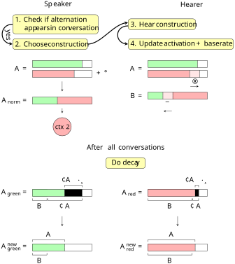

## Introduction {#sec-introduction}

Syntactic or structural priming, the increased probability of repeating a syntactic structure as a speaker given past exposure to that structure as a hearer [@bock_syntactic_1986, @pickering_representation_1998, @mahowald_meta-analysis_2016], is widely accepted in linguistics as a fleeting effect. Some studies, however, show that priming effects could last longer, which, in theory, opens the door to language change on a longer term. In this article, we investigate to what extent syntactic priming could, theoretically, lead to language change. Due to practical constraints, we do so by deploying an agent-based model [@steels_modeling_2011]. Because agent-based models require precise formalisations of linguistic behaviour and associated theories [@alishahi_computational_2010, 5], we first give an overview of the properties of priming, and the different ways in which researchers have tried to explain the phenomenon so far. Then, we detail how our computer model implements these findings, and how we exactly we model priming and measure the broad concept "language change". Finally, we discuss the results of our simulations and discuss what repercussions our findings could have on priming theory in the context of language change.

## Literature review {#sec-review}

### Properties of priming {#sec-review-priming-properties}

The core mechanism of syntactic priming is straightforward. A hearer encounters a choice that was made in a syntactic alternation by another speaker, for example in the dative alternation [@bresnan_predicting_2007]:

1. I gave some treats to the cat. (PO construction)

However, the speaker could have also said:

2. I gave the cat some treats. (DO construction)

Still, because the speaker chose structure 1, the probability is higher for the hearer of that sentence to also use the PO construction in the near future, in lieu of the DO construction.

Additionally, three other factors generally influence the priming effect [@segaert_unifying_2016, 60]. The first is the so-called lexical boost effect [@hartsuiker_syntactic_2008]: if the lexical material in the priming construction overlaps with the lexical material in a future utterance, priming is assumed to be stronger. To demonstrate this, let us return to our example. If, during planning for a new utterance, a choice needs to be made for a dative alternation, and *give* is the planned main verb, in general, this choice will sway towards the PO-construction. This is because of the lexical overlap between the sentence that caused the priming and the new utterance: both feature the main verb *give*.

The second additional factor is the inverse frequency effect [@ferreira_misinterpretation_2003; @ferreira_functions_2006]: if a specific syntactic structure is infrequent or, more generally, unexpected [@bernolet_does_2010], its priming effect is stronger than for a frequent, expected structure. As an example, @rosemeyer_entrenchment_2019 show that the acquainted Spanish subjunctive marker *-ra* shows much stronger priming effects than the contemporary alternative *-se*. As speakers do not typically expect the older form, encountering *-ra* elicits surprise, and makes a stronger impression. This impression causes a bigger priming effect. @ferreira_functions_2006 [1018] argue that the inverse frequency effect prevents one syntactic structure from becoming overly dominant, since infrequent constructions can always, at least temporarily, work against a prevalent syntactic construction.

The final factor is the cumulativity of priming [@kaschak_long-term_2007; @kaschak_long_2014]. Priming experience can be accumulated over time, as more and more primes are encountered. In this way, priming itself is stronger and lasts longer (see also below).

### Two ways of explaining priming {#sec-review-priming-explanations}

The additional properties of priming make it an interesting phenomenon to attempt to explain. Priming can be accumulated when similar primes are repeated, and lexical overlap makes priming even more probable. At the same time, if a prime is particularly unexpected, it also has an influence on priming strength, which can be seen as the reverse of cumulativity. 

Generally speaking, there are two prevailing ways of explaining priming [@van_lieburg_two_2023, 265-266]: residual activation and error-based learning. Residual activation sees priming as the activation of specific nodes in the brain. Again, referring to our initial example, this would imply that the PO node becomes activated or "hot" when it is encountered, which makes that node privileged during production. The lexical boost, which only lasts for one sentence or so [@hartsuiker_syntactic_2008, 233], can be explained in this way: when the PO construction is encountered with the verb *give*, the activation *between* the PO node and the node for the word *give* remains active as well [@pickering_representation_1998, 634-635]. This provides the additional, "lexical" boost. Since activated nodes are assumed to decay very quickly [@hartsuiker_syntactic_2008, 216], this would explain the short lifespan of the lexical boost effect. Accordingly, residual activation is most apt to explain priming in the short-term.

The other explanation is based on implicit learning [@bock_persistence_2000]. In an implicit learning system, the different parts of a system are tuned as the system is used [@ferreira_functions_2006, 1014]. When a specific syntactic construction is encountered often, the system is tuned to produce it more often. However, constructions that are seldomly used cause the system to be tuned as well. Since hearers predict, based on current input, what they think they will read or hear next [@pickering_predicting_2018], they also notice whenever this internal prediction is inconsistent with the *actual* input. To prevent future prediction errors, the internal prediction engine needs to be adjusted to account for that recently encountered input. Error-based learning [@chang_becoming_2006] can explain for this phenomenon: whenever there is a difference between a prediction and the actual input ("error"), the system's weights are adapted for future use [so-called "backpropagation", common in machine learning training procedures, @werbos_backpropagation_1990]. Implicit learning can explain both "regular" priming, cumulativity and the inverse frequency effect. For regular priming, weights are tuned in a cumulative fashion to facilitate easier production in the future, but whenever an infrequent construction is encountered, the prediction error between expected and actual behaviour causes the system's internal weights to be shifted towards the infrequent construction. This would also explain why, under the inverse frequency effect, priming is stronger than for "neutral" priming [@ferreira_functions_2006, 1016]. Since implicit learning implies the adaptation of an internal weights structure, it is most apt to explain priming in the long-term.[^explicit-learning] How long is "long-term" really, however? According to @kaschak_long-term_2011, cumulative syntactic priming effects can still be measured after one week. This is also the case for more general priming in psychology, as @moutsopoulou_how_2019 found priming effects after one week for a classification task. @heyselaar_structural_2022 found priming effects to persist for four weeks, but only for younger adults.

[^explicit-learning]: For completeness' sake, we also mention that *explicit* learning implies storing utterances wholly in memory [@ferreira_functions_2006, 1018], in contrast to implicit learning, where linguistic knowledge is updated upon exposure.

### Interaction with base frequency in linguistics {#sec-review-base-rate}

We mentioned in the beginning of this article that our aim is to find out to what extent priming can lead to language change. More specifically, this implies investigating how priming can affect the "base rate" of language production, i.e. how frequent specific structures are produced when priming is *not* active whatsoever. The reverse direction, studied by @kaschak_long-term_2007, is also important, however: to what extent does base rate have an influence on priming? The experimental set-up is as follows: first, there is a *bias* phase in which the participants' base rate is manipulated. This is done by having them complete DO or PO sentences, with the latter half missing. Then, in the *priming* phase, participants are free to complete sentences in whichever way they wish, so either using a DO or a PO construction. A norming study was also organised, in which there was no bias phase. Additionally, in a similar experiment, @kaschak_recent_2006, participants also encountered primes right before they were left to complete sentences freely. The combination of these different studies leads to the following conclusions:

1. Without a bias phase, i.e. if base rate is not manipulated, completions in the priming phase follow the expected distribution in English: DO constructions are produced more than PO constructions.
2. When the bias phase offers 50% DO sentences and 50% PO sentences, completions in the priming phase sway in favour of the PO construction. This is assumed to be an inverse frequency and cumulative priming effect [@hartsuiker_word_2000, 36].
3. When the bias phase offers 50% DO sentences and 50% PO sentences, and PO primes are shown in the priming phase, completions sway even more in favour of the PO construction.
4. Crucially, if the bias phase offers 75% or even 100% DO sentences, but PO primes are shown in the priming phase, completions remain at a level comparable to the 50% DO bias phase.
5. Comparatively, when the bias phase offers 100% PO sentences, and DO primes are shown in the priming phase, completions sway in favour of the DO construction, but to a lesser extent than in the reverse situation. This is the inverse frequency effect.

These results teach us that base rate and priming seem to operate at two distinct levels. When base rate is influenced, this does not have a significant impact on priming strength. This finding poses a problem for the implicit learning explanation of priming [@kaschak_long-term_2007, 935]: if the base rate is heavily shifted towards the DO construction, the "error" for a PO prime should be larger, and priming should be stronger. This is, however, not the case.[^lexical-boost] An alternative explanation of priming compatible with this finding is offered in the next section.

[^lexical-boost]: @kaschak_long-term_2007 also found lexical boost effects, which are not compatible with the implicit learning activation either. In the remainder of the article, we will not focus as much on the lexical boost as it is does not make a part of our simulation.

### Two-stage competition model {#sec-review-two-stage-competition}

The two-stage competition model [@segaert_unifying_2016] is an alternative model for explaining priming behaviour based on residual activation (see above). It is borne out of inconsistencies in priming theory with regards to production latency. While the inverse frequency effect has been established several times for priming strength, it is not applicable to production latency [@segaert_unifying_2016, 60]: more exposure means lower production latency, though the inverse frequency effect can still apply for priming strength itself, i.e. the choice between onstructions. The two-stage competition attempts to bridge the theoretical gap between choice and latency behaviour in priming by separating it into two stages: the selection stage, in which one of usually two constructions is chosen (i.e. DO vs. PO), and a planning stage, in which the production of that construction is prepared. Further in this section, we will explain how both stages work, and how the two-stage architecture addresses other theories' inconsistencies.

In the selection stage, a choice needs to be made between competing syntactic constructions. In the model, each alternative is seen as a node with a distinct activation level. The base activation is correlated with base rate (see above): in non-priming situations, production and reception probabilities run in parallel. When a hearer is exposed to one of either constructions, the activation level for that construction's node is increased. For a frequent construction, this is straightforward, as base activation is already high. When an infrequent construction is encountered, however, more activation needs to be sent to that construction's node [@segaert_unifying_2016, 63], since its base activation is lower. They argue that the inverse frequency effect can be explained on this ground, since residual activation will be more impactful for infrequent constructions than for frequent constructions. Cumulative exposure to infrequent constructions "can boost the base-level activation of the structure to such a level that when preceded by an immediate prime, the less preferred structure now has an activation level close to or even higher than that of the preferred structure" [@segaert_unifying_2016, 65].[^lexical-boost-two-stage] If activation levels are brought closer together when exposed to an infrequent variant, it becomes more difficult as a speaker to choose between constructions, which increases selection time [@segaert_unifying_2016, 75]. In contrast, if activation levels are asymmetric, i.e. because the most frequent form is readily activated, selection time is said to decrease.

[^lexical-boost-two-stage]: The lexical boost effect is also accounted for in the two-stage competition model. When lexical material is encountered in a specific construction, the node of that construction is connected to that verb's node [@segaert_unifying_2016, 64]. 

In the second stage, the planning stage, the selected construction is planned for actual output. Priming is argued to always decrease planning time, regardless of whether the primed construction is frequent or infrequent.

The combination of both the selection and the planning stage can explain both choice and production behaviour. In our case, it also provides an explanation for some theoretical inconsistencies we encountered earlier. The two-stage competition model decouples activation from base rate, which is compatible with the behaviour found in @kaschak_long-term_2007. Furthermore, it explains the inverse frequency effect, lexical boost, and cumulativity. The two-stage competition model seems the most informative theoretical model, then, to inform us about the interaction between priming and language change. We have therefore chosen this model as the basis for the formalisation in our computer simulations (see @sec-model-design).

### Language change and difference with entrenchment {#sec-review-language-change-entrenchment}

Since we want to investigate the role of priming in language change, it is important to also define how we define language change. For our purposes, we restrict language change to the propagation or spread of an innovative syntactic construction at the disadvantage of an older construction. This propagation is always fuelled by an inherent advantage for the innovative variant over the older variant, be it an advantage in processing ease, a phonetic bias or a social influence [@blythe_s-curves_2012, 273]. @baxter_modeling_2009 [269] call this "replicator selection", because the replicator itself, in this case the syntactic variant, has some advantage that causes it to be picked up easily by others. Following @dekker_conversational_2024, we will assume that such a change is ongoing in our computer simulations, i.e. that some innovative form has an advantage that causes it to be more likely to be selected than the other, older form.

Additionally, we briefly discuss how priming differs from entrenchment, because entrenchment is also key in language change. For our purposes, we define entrenchment as the anchoring or fixation of a specific construction in memory [roughly after @schmid_entrenchment_2007]. Updates to the base rate can be seen as a way of entrenchment: because a construction was recently encountered, that construction is now more firmly represented in memory [in our case at the expense of an alternative construction, which can be seen as a form of lateral inhibition, see for example @radulescu_modelling_2016]. Replicator selection, together with entrenchment, is in principle enough to give rise to language change: one construction is preferred over another, and over time this other construction will become more entrenched in all language users' memories. The contribution of priming, and thus the major difference with entrenchment alone, is apparent during speech time. Instead of choosing a construction to utter based on how entrenched the different choices are ["probability matching", @labov_principles_1994, 580], an additional "recency" layer influences construction choice. Hearing a construction is thus far more influential than a slight change to the base rate alone, and the influence is potentially complex given mechanisms like inverse frequency and cumulativity (see @sec-review-priming-properties). Regardless, these additional influences in the end all still amount to updates to the base rate, so entrenchment remains the underlying core principle.

### Using agent-based simulations for studying language change {#sec-review-abm}

As we mentioned in the introduction to this article, we use an agent-based simulation in order to investigate the relationship between priming and language change. An agent-based model is a type of computer simulation in which virtualised people, "agents", interact with each other based on simple principles [@steels_modeling_2011]. This is especially interesting given the view on language as a complex-adaptive system [@beckner_language_2009], i.e. a decentral system in which agents collectively shape the system as a whole. While the individual behaviour of agents is simple, the interplay of their individual behaviours can cause unpredictable emergent behaviour.

Using agent-based models for studying the effect of priming on language change is particularly useful, since real-life experiments can only go so far. Current experimental studies show priming effects from a week to a month [@kaschak_long-term_2011; @heyselaar_structural_2022]. Devising experiments on an even larger time-scale is organisationally difficult: as the experiment's time-scale increases, it becomes more difficult to control the experiment as participants will be increasingly exposed to linguistic stimuli outside the researcher's control, not to mention that finding participants for a long-lasting study is difficult in the first place. Computer simulations can help us test questions on a longer time-scale than is feasible empirically [@gong_computer_2013, 13].

Note, however, that computer simulations are necessarily simplifications of real life [@ohmer_communication_2025, 313]: because simulations focus on a subset of reality, we learn how this subset contributes to the problem at hand, without the typical outside disturbances that plague real life. At the same time, this means that the results of simulations never deliver decisive conclusions about real life, but rather suggestions of how real life *could* work. 

Agent-based models have been deployed before for studying the effect of priming on language change. @dekker_conversational_2024 constructed an agent-based model which studies conversational priming, and found that (1) given an inherent advantage of an innovative form, conversational priming can help that form spread faster (2) in select cases, priming effects can overrule the conserving effect of frequency, i.e. the resistance to analogical change due to entrenchment [@bybee_usage_2006, 5]. Still, this model (1) assumes comprehension-to-production priming, i.e. the fact that priming also happens when a form is repeated as part of the answer to a conversation (2) does not involve sensitivity to frequency on two levels [which is needed to account for the behaviour found in @kaschak_long-term_2007] (3) does not take into account the inverse frequency effect.

In our study, then, we aim to investigate to what extent priming, when modelled according to the two-stage competition model [@segaert_unifying_2016], has an influence on language change, which we define as a change in the base rate of an innovative construction. More specifically, we want to know how properties such as cumulativity and the inverse frequency effect (see @sec-review-priming-properties) have an effect on language change. In order to not complicate the design of our study, we decided not to focus on the lexical boost effect, especially since it is moreso an additional effect. In the next section, we will detail the design of our simulation model, and how exactly we implemented the two-stage competition model.

## Model design {#sec-model-design}

In this section, we discuss how exactly we built our model of priming. More specifically, we show what capabilities our agents have, how they enter into conversation with each other, and what parameters are available. We also show how we translate the principles from @segaert_unifying_2016 to our computer model. To keep the model straightforward, we model one alternation with two choices [like @dekker_conversational_2024]. Our model was implemented using Python and the MESA library [@kazil_utilizing_2020]. All source code is available online.[^github-link]

[^github-link]: todo

### Frequency tally {#sec-model-design-frequency-tally}

Following the two-stage competition model, each agent keeps track of two types of frequency: base rate and activation. An agent's base rate represents the agent's personal division between two constructions in unprimed usage, while activation level represents how "hot" a construction's node currently is in memory.

Base rate is implemented as a vector $\mathbf{B}$ of size $2$. Since base rate represents a division between two constructions, each vector value sits between 0 and 1, and all values should sum to one: $B_1 + B_2 = 1, \text{with } B_1, B_2 \in [0, 1]$. When we check the influence of priming on language change, we will look at the evolution this base rate.

Activation level is implemented as a vector $\mathbf{A}$, also of size $2$. Activation is separate for each construction, so the sum of the two values does not have to be one. This means that activation can, in principle, rise to infinity: $A_1, A_2 \in [0, +\infty]$.

### Language game and course of the simulation {#sec-model-design-language-game}

In this section, we explain how the simulation itself works, and how agents have "conversations" with each other. We also show how they update their internal representations as the result of these conversations.

#### Initialisation and general workings {#sec-model-design-initialisation}

All $N$ agents in our simulation are initialised with the same values for the base rate. We do not have separate "innovators" and "conservators" as in @dekker_conversational_2024.[^innovators-conservators-useless]. Activation levels start at the same level as the base rate, which reflects the idea that base activation mirrors base rate (see @sec-review-two-stage-competition). After the initialisation phase, time starts advancing in our model. At each time step, the agents in our model have the opportunity of entering into conversation with another agent. This phase is often called a "language game" [@smith_models_2014], as agents usually have to cooperate or respond to something in their environment through language, which in turn influences that language. In this simulation, however, the linguistic exchange is quite simple, and no cooperation is required. Still, for clarity's sake, we will refer to the exchange between speaker and hearer as a language game.

[^innovators-conservators-useless]: We initially did include a distinction between innovators and conservators, but found that the distinction between the two groups was quickly lost as both groups base rates converged and then remained the same. We therefore decided not to include the distinction in our simulations.

#### Language game {#sec-model-design-language-game}

The language game between speaker and hearer goes as follows:

**Speaker**

1. First, it needs to be decided whether the chosen agent actually gets to speak. A number $p \in [0, 1]$ is randomly generated, and if $p > P, \text{with } P \in [0, 1]$, the speaking probability, then the conversation can take place. Speaking probability is a proxy for the frequency of the construction that is subject to priming: a frequent construction has a higher probability of occurrence in conversation than a less frequent construction. By varying $P$, we can check what the influence of a construction's frequency is during priming.
2. The speaker now has to choose one of two constructions to utter to the hearer. The probability of choosing either construction is computed by normalising their activation levels. However, because replicator selection is active -- the innovative variant has an advantage over the older variant, we add a bias activation value $\gamma$ to the innovative's variant activation level before normalisation. 
  $$
  \mathbf{A}_{\text{normalised}} = \frac{\mathbf{A}}{\sum_{i=1}^{2} \tilde{A}_i}, \quad \text{where } \tilde{A}_i = 
  \begin{cases} 
    A_i + \gamma & \text{if } i = \text{innovative} \\
    A_i & \text{otherwise}
  \end{cases}
  $$
  Based on the probability distribution $\mathbf{A}_\text{normalised}$, one of two constructions is chosen.
3. The chosen construction is communicated to the hearer.

**Hearer**

1. The hearer "hears" the construction that was spoken by the speaker.
2. Because the construction is now "activated" in the hearer's mind, we update the activation level of that construction by adding a fixed priming strength $\alpha$:
  $$
  {A}_{\text{heard}}^{\text{new}} = {A}_{\text{heard}} + \alpha
  $$
3. Additionally, the base rate for the construction is updated. For this, we use the same update mechanism as the one from @dekker_conversational_2024. A fixed value is added to the base rate, and the vector is normalised to again sum to one.
  $$
  \begin{aligned}
    &{B}_{\text{heard}}^\text{new} = \frac{{B}_\text{heard} + \beta}{1 + \beta}\\
    &{B}_{\text{not heard}}^\text{new} = \frac{{B}_\text{not heard} + \beta}{1 + \beta} \\
  \end{aligned}
  $$

An overview of the language game is given in @fig-model_design_language_game.

{#fig-model_design_language_game}

Finally, after all speaking opportunities have passed, all activation levels decay towards the base rate. For each agent, the difference between activation and base rate, $\Delta A$, multiplied by a decay rate $\lambda$, is subtracted from the activation levels. If any value $\Delta A$ is smaller than $\epsilon = 0.05$, the activation level snaps directly to the base rate, to prevent the activation levels from becoming asymptotic. A formal representation is given in @eq-decay.

$$
\begin{aligned}
  &\Delta \mathbf{A} = \mathbf{A} - \mathbf{B} \\
  &\text{For each construction } i \in \{1, 2\}: \\
    &\hspace{1cm} A_i^{new} = \begin{cases} 
      B_i & \text{if } \Delta A_i \le \epsilon \\
      A_i - (\Delta A_i \cdot \lambda) & \text{otherwise}
    \end{cases} \\
\end{aligned}
$$ {#eq-decay}

#### Inverse frequency effect {#sec-model-design-inverse-frequency-effect}

If the inverse frequency effect is active, we change the activation level update formula so priming strength $\alpha$ is modulated depending on the "unexpectedness" of hearing a specific construction. We compute a multiplier for $\alpha$ by dividing $\alpha$ by the current activation level of the heard construction. This entails that, if a construction is already highly activated, additional priming will be attenuated. Conversely, if a construction is barely activated at all, priming will be amplified. The multiplier can be regulated through an exponent $\kappa$. In the end, however, we cap the resulting multiplier at $2$ to prevent ballooning activation levels. Additionally, we use Laplace smoothing [@brysbaert_dealing_2013] to prevent division by zero when computing the multiplier itself. An overview of the activation level update formula adjusted for the inverse frequency effect is given in @eq-inverse-frequency-update.

$$
A_{\text{heard}}^{\text{new}} = A_{\text{heard}} + \alpha \cdot \operatorname{min}\left(2, (\frac{\alpha + 0.001}{A_{\text{heard}} + 0.001})^\kappa \right)
$$ {#eq-inverse-frequency-update}

## Evaluation {#sec-evaluation}

In this section, we explain how we assess whether priming influences language change in any way, and how we can check this.

### Assessing the influence of priming and other factors {#sec-evaluation-priming-influence}

First and foremost, because the interplay of different priming factors is unpredictable, our investigation of the effect of priming on language change is primarily explorative in nature. We track how the base rate evolves under the influence of different parameter values. Because each agent keeps track of their own base rate levels, we take the median of all agents' base rates at each step. Furthermore, our methodology is incremental: we start from a baseline situation *without* the inverse frequency, and investigate how construction frequencies and different replicator selection strengths influence the evolution of the base rate among agents. Afterwards, we can compare these results to an implementation *with* inverse frequency. This incremental workflow is inspired by the principle of Occam's razor [@pijpops_agent-gebaseerde_2015, 12], which dictates that the simplest explanation for a phenomenon is the most likely explanation. Because we start from a simple set-up and incrementally increase complexity, we are able to (1) first understand the dynamics in the simpler system before attempting to explain the behaviour in a more complex system (2) assess whether the addition of another mechanism has an influence on the system's behaviour in the first place. The latter mechanism means we effectively apply the principle of Occam's razor in reverse.

### Parameters {#sec-evaluation-parameters}

In this section, we show the default values for the different parameters in our computer model. If these parameters change, the behaviour of the simulation changes as well. If any of these default parameters are overridden, we will mention this clearly.

| Parameter | Explanation | Value(s) |
| --- | --- | --- |
| $N$ | Number of agents | 10 |
| $P$ | Speaking probability, proxy for alternation frequency | 0.01, 0.05, 0.4 |
| $\alpha$ | Priming strength | 0.4 |
| $\gamma$ | Replicator selection bias | 0.01, 0.05, 0.1 |
| $\beta$ | Base rate change strength | 0.01 |
| $\lambda$ | Decay rate for delta between activation and base rate ($\Delta \mathbf{A}$) | 0.5 |
| $\epsilon$ | Below this value for $\Delta \mathbf{A}$, activation snaps to base rate immediately | 0.05 |
| $\kappa$ | Exponent for the inverse frequency multiplier | 1 |
: An overview of all parameters in the simulation and their values. {#tbl-parameters}

## Results {#sec-results}

In this section, we show the results of the different parameter permutations in our computer simulations.

### Without the inverse frequency effect {#sec-results-no-inverse-frequency}

First, we show simulations in which the inverse frequency effect is disabled. We vary the different parameter values for alternation frequency (through its proxy "priming opportunity") and replicator selection to check their effects on how language changes. @fig-without-inverse-frequency-ctx_base_rate_mean shows this visually. As is clear from the graph, the more frequent an alternation, the more opportunities there are for the alternation to be used, and thus for both replicator selection and priming to boost the innovative construction. Unsurprisingly, high priming opportunity thus leads to a faster spread of the innovative construction. Interestingly, priming opportunity seems to matter more for the pace of propagation than the strength of replicator selection: a high-frequency alternation with low replicator selection strength has the innovative form evolve faster than a low-frequency alternation with high replicator selection strength.

Additionally, we varied the decay rate of the priming effect. Recall that this parameter regulates how quickly the activation level of a construction decays back to the regular level dictated by the current base rate. @fig-without-inverse-frequency-decay-split-ctx_base_rate_mean shows that, as decay rate becomes smaller, propagation goes faster. As a primed construction remains highly activated for longer, it continues to affect the base rate for a longer time as well. We see that the effect of a smaller decay rate is bigger for a high-frequency alternation. This makes sense: if an alternation is of a low frequency, the window of opportunity to make use of prolonged priming has already passed by the time the alternation is relevant again.

::: {#fig-no-inverse-frequency layout-ncol=2}
{#fig-without-inverse-frequency-ctx_base_rate_mean}

{#fig-without-inverse-frequency-decay-split-ctx_base_rate_mean}

Evolution of the median base rate across agents for different frequencies, broken down by replicator selection strength and decay rate values, for the model without the inverse frequency effect.
:::

### With the inverse frequency effect {#sec-results-with-inverse-frequency}

In this section, we show how the evolution of the innovative construction changes when the inverse frequency effect is enabled. This is the most complete realisation of the two-stage competition model (see @sec-review-two-stage-competition), as low-frequency constructions are assumed to require more activation. @fig-with-inverse-frequency-ctx_base_rate_mean shows that the effect on the spread of the innovative construction has completely changed. Perhaps counterintuitively, we see that in a high-frequency alternation, the spread of the innovative construction stalls. The effect of replicator selection strength remains apparent, however, as a high replicator selection strength seems to cause the spread to stall at a much higher base rate level. We also see that for a high-frequency alternation paired with a high replicator selection strength, a breakthrough in propagation *can* happen after a very long time. The wide confidence interval shows that this is not always the case, however. At the same time, in a low-frequency alternation, the innovative construction is always able to spread without issue, albeit very slowly when replicator selection is weak. The stalling phenomenon is to be understood from the behaviour of the inverse frequency effect: as the innovative construction passes the halfway mark and becomes the most dominant construction, inverse frequency starts to work against the spread of the construction. As we saw already in the results without the inverse frequency effect, priming is stronger than replicator selection when an alternation is very frequent. When pitted against each other, then, the inverse frequency effect now working *against* the innovative variant is stronger than the replicator selection mechanism, and the spread of the innovative variant comes to a halt. Only when replicator selection is very strong, can it perhaps eventually "win out" against inverse frequency. In contrast, when frequency is too low, the activation of a primed construction does not last until the next speaking opportunity, and priming no longer plays a role. In this way, the innovative construction can continue to spread, despite the presence of the inverse frequency effect.

We again also show the effect of varying decay rate of the priming effect. @fig-with-inverse-frequency-decay-split-ctx_base_rate_mean shows that decay rate can play an important role in shaping the way the innovative form spreads. The first effect pertains to the speed at which the spread stalls: since decay rate makes priming last longer, the initial propagation goes faster when decay rate is smaller. The second effect pertains to the ceiling effect. We saw previously that lower frequency alternations are not subject to the ceiling effect for the propagation of the innovative form, since the increased activation has already decayed once the next speaking opportunity arises. When decay rate is set low enough, however, priming lasts for so long that even at the medium frequency tier we added (priming opportunity of $0.1$), the ceiling effect can be achieved. Finally, we see that the level of the ceiling effect itself increases as decay rate increases: because past the halfway point, priming now works *against* the innovative construction, the innovative construction profits from a faster decay, and thus less performant priming. This is also best noticeable for the medium frequency level. For high frequency alternations, the next priming opportunity too early for decay rate to have an effect on the ceiling level. For low frequency alternations, the ceiling effect does not manifest itself, and there cannot be a difference in ceiling.

::: {#fig-with-inverse-frequency layout-ncol=2}
{#fig-with-inverse-frequency-ctx_base_rate_mean}

{#fig-with-inverse-frequency-decay-split-ctx_base_rate_mean}

Evolution of the median base rate across agents for different frequencies, broken down by replicator selection strength and decay rate values, for the model with the inverse frequency effect.
:::

## Discussion {#sec-discussion}

In this article, we investigated the effect of priming and its several properties (cumulativity, inverse frequency effect), together with several aspects of language change such as alternation frequency and replicator selection, through an agent-based model. We found that the role of frequency in priming is ambiguous in our model: when an alternation occurs often, priming occurs often as well, and the innovative form (in an advantageous position thanks to replicator selection) can spread faster than when an alternation occurs more rarely. At the same time, the inverse frequency effect, i.e. the effect that low frequency constructions cause a stronger priming effect, makes it so the spread of the innovative construction stalls once it becomes dominant: the inverse frequency effect now works in favour of the older variant, effectively causing a "stalemate" in the evolution of the constructions in alternation. For low frequency alternations in our model, priming effects do not last long enough to make a difference. By the time a new speaking opportunity arises, all inverse frequency priming effects have decayed, and the stalemate that maintains variation does not occur. Such an outcome is not unrealistic when we look at real-world variation. For example, the so-called "red" and "green" word order in verbal clusters in Dutch [see @de_sutter_rood_2005; @bloem_processing_2021; @sevenants_investigating_2026] is infamously difficult to model probabilistically in thanks to its maintained free variation. While we do not declare definitively that red and green word order variation in Dutch is kept due to priming effects, we do posit it as a possible explanation, especially since the alternation occurs very regularly in Dutch.

The inclusion of decay rate in our model also shows that cumulativity, the gradual build-up of priming effects through exposure, is more than just a proxy of the frequency of a prime. When priming decays slowly, even medium frequency alternations can show the stalemate effect mentioned previously. Cumulativity is thus a complex phenomenon in our model that goes beyond the simple recurrence or renewal of a prime. The same applies to entrenchment: slower decay leads to stronger entrenchment, though entrenchment is typically associated with frequency. At the same time, fast decay can be beneficial for the entrenchment of an innovative construction: when an innovative construction has become dominant, the inverse frequency effect does not boost the older construction as much, which leads to higher entrenchment of said innovative construction.

In a broader priming context, our model results show that the dominant idea of priming as a "frequency positive" effect, i.e. an effect that always accelerates language change, might be naive. This view is only valid when we do not take into account the inverse frequency effect, but that view does not assume priming in all its complexity.

Still, this does not entail that our model is "complete". For example, it would be interesting to focus even more on the cognitive aspect of priming. While for our purposes, the explicit assumption of the inverse frequency mechanism sufficed to study its relation to language change, it would be interesting to find out how one can model the inverse frequency outcome without explicitly modelling it outright [like @gahl_time_2024 sidestep modelling word frequency explicitly by treating it as a complex effect of other factors].

More generally, still, we show that there is worth in using computer simulations to study how phenomena in usage-based linguistics interact, even for relatively well-researched phenomena such as priming. In our case, the choice for computer simulations is also dictated by practical concerns: the time-scale required to study language change exceeds the practical limits of experimental research. At the same time, we stress that computer simulations are not replacements for empirical or experimental research. Our computer model is strongly rooted in empirical findings, which we attempted to extrapolate *in silico* on a much longer timescale. Conversely, we hope our findings can in turn inform further empirical research, and thus feed back into research *in vivo*.
